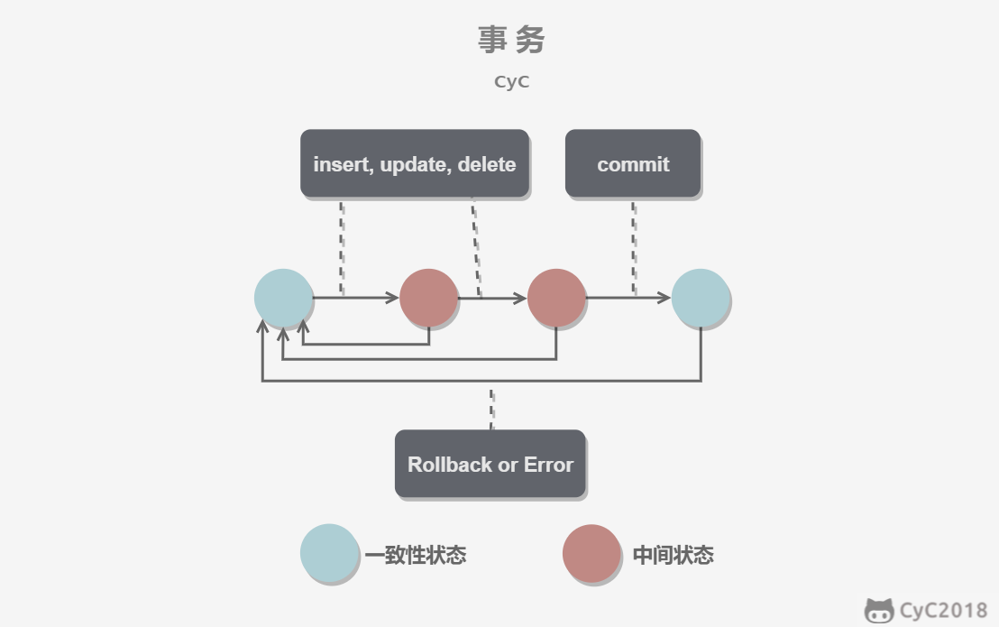
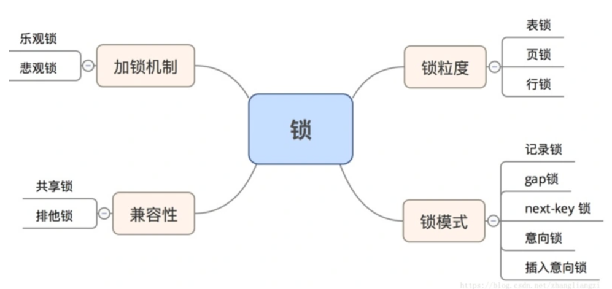
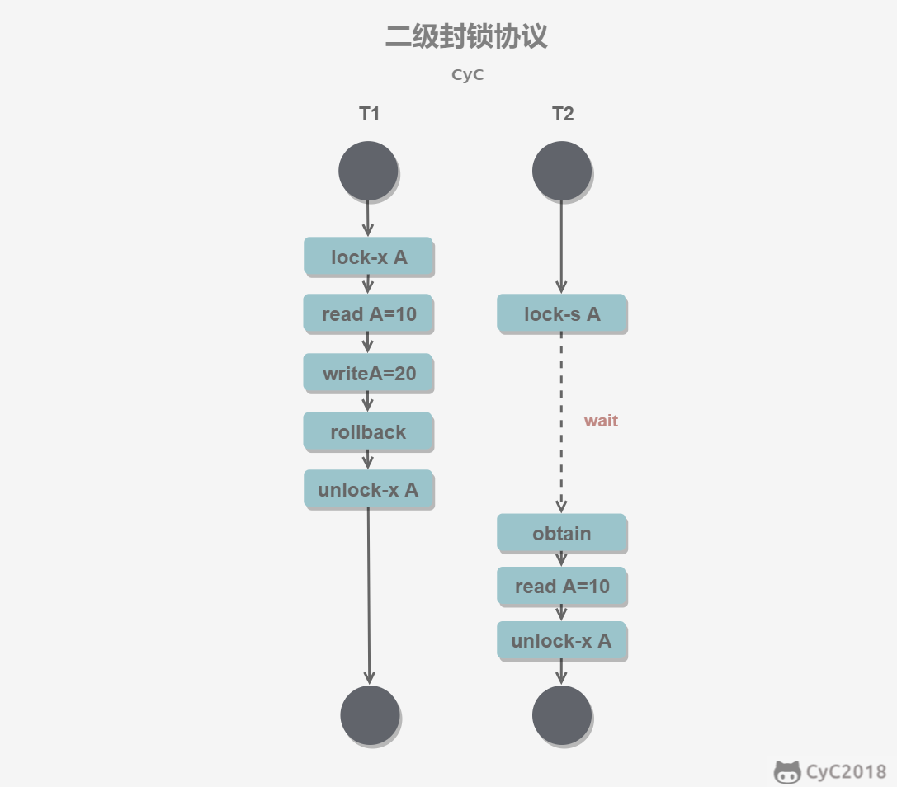
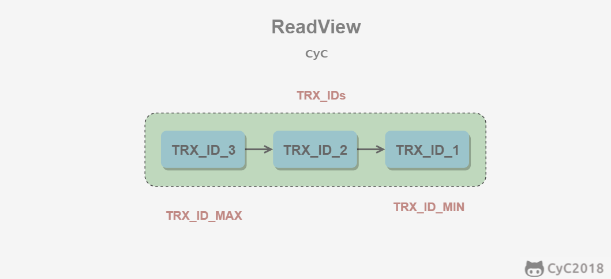

# ACID

事务是由一组 SQL 语句组成的逻辑处理单元，事务具有 ACID 属性。

- 原子性（Atomicity）：事务是一个原子操作单元。在当时原子是不可分割的最小元素，其对数据的修改，要么全部成功，要么全部都不成功。如果事务执行中发生失败，会回滚到事务执行之前的状态。
- 一致性（Consistent）：事务开始到结束的时间段内，数据都必须保持一致状态。数据一致性，就是当多个用户试图同时访问一个数据库，它们的事务同时使用相同的数据，可能会发生以下四种情况：（写写）丢失更新、未确定的相关性、不一致的分析和幻想读。数据库一致性指的是事务执行之前和执行之后都要满足数据库的约束，例如外键约束、唯一键约束等。
- 隔离性（Isolation）：数据库系统提供一定的隔离机制，保证事务在不受外部并发操作影响的"独立"环境执行。
- 持久性（Durable）：事务完成后，它对于数据的修改是永久性的，即使出现系统故障也能够保持。

事务指的是满足 ACID 特性的一组操作，可以通过 Commit 提交一个事务，也可以使用 Rollback 进行回滚。

<div align="center">  </div><br>

### 1. 原子性（Atomicity）

事务被视为不可分割的最小单元，事务的所有操作要么全部提交成功，要么全部失败回滚。

回滚可以用回滚日志（Undo Log）来实现，回滚日志记录着事务所执行的修改操作，在回滚时反向执行这些修改操作即可。

### 2. 一致性（Consistency）

数据库在事务执行前后都保持一致性状态。在一致性状态下，所有事务对同一个数据的读取结果都是相同的。

### 3. 隔离性（Isolation）

一个事务所做的修改在最终提交以前，对其它事务是不可见的。

### 4. 持久性（Durability）

一旦事务提交，则其所做的修改将会永远保存到数据库中。即使系统发生崩溃，事务执行的结果也不能丢失。

系统发生奔溃可以用重做日志（Redo Log）进行恢复，从而实现持久性。与回滚日志记录数据的逻辑修改不同，重做日志记录的是数据页的物理修改。

---

事务的 ACID 特性概念简单，但不是很好理解，主要是因为这几个特性不是一种平级关系：

- 只有满足一致性，事务的执行结果才是正确的。
- 在无并发的情况下，事务串行执行，隔离性一定能够满足。此时只要能满足原子性，就一定能满足一致性。
- 在并发的情况下，多个事务并行执行，事务不仅要满足原子性，还需要满足隔离性，才能满足一致性。
- 事务满足持久化是为了能应对系统崩溃的情况。

<div align="center">  </div><br>

# ACID 四种特性分别是如何实现的？

# 事务常见问题

|     | 读   | 写    |
| --- | --- | ---- |
| 读   | 正常  | 脏读   |
| 写   | 幻读  | 更新丢失 |

- 更新丢失（Lost Update）原因：当多个事务选择同一行操作，并且都是基于最初选定的值，由于每个事务都不知道其他事务的存在，就会发生更新覆盖的问题。类比 github 提交冲突。
- 脏读（Dirty Reads）原因：事务 A 读取了事务 B 已经修改但尚未提交的数据。若事务 B 回滚数据，事务 A 的数据存在不一致性的问题。脏读就是读未提交。
- 不可重复读（Non-Repeatable Reads）原因：事务 A 第一次读取最初数据，第二次读取事务 B 已经提交的修改或删除数据。导致两次读取数据不一致。不符合事务的隔离性。幻读就是读已提交。指的是单行数据。
- 幻读（Phantom Reads）原因：事务 A 根据相同条件第二次查询到事务 B 提交的新增数据，两次数据结果集不一致。不符合事务的隔离性。指的是查询到数据的条数发生变化。幻读不一定是 insert 操作，也可能是 update 操作更改了某列的值。

脏读、幻读、不可重复读的区别：  
别人写数据，我读数据。别人未提交，则我脏读。别人已提交，若别人提交的是 update/delete，则我不可重复读；若别人提交的是 insert，则我幻读。

# 并发一致性问题

在并发环境下，事务的隔离性很难保证，因此会出现很多并发一致性问题。

## 丢失修改

丢失修改指一个事务的更新操作被另外一个事务的更新操作替换。一般在现实生活中常会遇到，例如：T<sub>1</sub> 和 T<sub>2</sub> 两个事务都对一个数据进行修改，T<sub>1</sub> 先修改并提交生效，T<sub>2</sub> 随后修改，T<sub>2</sub> 的修改覆盖了 T<sub>1</sub> 的修改。

<div align="center">  </div><br>

## 读脏数据

读脏数据指在不同的事务下，当前事务可以读到另外事务未提交的数据。例如：T<sub>1</sub> 修改一个数据但未提交，T<sub>2</sub> 随后读取这个数据。如果 T<sub>1</sub> 撤销了这次修改，那么 T<sub>2</sub> 读取的数据是脏数据。

<div align="center">  </div><br>

## 不可重复读

不可重复读指在一个事务内多次读取同一数据集合。在这一事务还未结束前，另一事务也访问了该同一数据集合并做了修改，由于第二个事务的修改，第一次事务的两次读取的数据可能不一致。例如：T<sub>2</sub> 读取一个数据，T<sub>1</sub> 对该数据做了修改。如果 T<sub>2</sub> 再次读取这个数据，此时读取的结果和第一次读取的结果不同。

<div align="center">  </div><br>

## 幻读

幻读本质上也属于不可重复读的情况，T<sub>1</sub> 读取某个范围的数据，T<sub>2</sub> 在这个范围内插入新的数据，T<sub>1</sub> 再次读取这个范围的数据，此时读取的结果和和第一次读取的结果不同。

<div align="center">  </div><br>

---

产生并发不一致性问题的主要原因是破坏了事务的隔离性，解决方法是通过并发控制来保证隔离性。并发控制可以通过封锁来实现，但是封锁操作需要用户自己控制，相当复杂。数据库管理系统提供了事务的隔离级别，让用户以一种更轻松的方式处理并发一致性问题。

# 数据库的 ACID 中的 I 表示 Isolation，隔离性有几种级别？

1. 读未提交（Read Uncommitted）：即便没有提交也会被其它事务读到
   最低级别的隔离级别，一个事务可以读取到另一个事务未提交的数据，可能会出现脏读、不可重复读和幻读等问题。
2. 读已提交（Read Committed）：只有已经提交的才会被其它事务读到
   一个事务只能读取到另一个事务已经提交的数据，避免了脏读问题，但仍可能出现不可重复读和幻读问题。
3. 可重复读（Repeatable Read）：读的时候，完全不考虑其它事务；事务一旦开始就创建一个时间戳
   一个事务在执行期间读取到的数据始终保持一致，不受其他事务的影响，避免了不可重复读问题，使用间隙锁、nextKeyLock 等锁的机制解决了幻读问题。
4. 串行化（Serializable）：最高级别的隔离级别，事务的执行有全局读写锁，所有事务必须按顺序依次执行，避免了所有并发问题，但也牺牲了系统的并发性能。

隔离级别越高，数据的一致性和隔离性就越好，但也会带来更多的性能开销和系统负担。在实际应用中，需要根据具体的业务需求和系统性能要求，选择合适的隔离级别。

事务容易存在的问题：脏读、幻读、不可重复读、更新丢失。  
更新丢失是严重错误，任何数据库都无法容忍这种错误。  
事务的隔离性为读未提交的时候，存在脏读问题。  
事务隔离性为读已提交的时候，脏读问题不存在，但是幻读和不可重复读问题依旧存在。  
事务隔离性为可重复读的时候，脏读、不可重复读消失，唯独存在幻读问题。  
串行化可以解决一切问题。但是并发性最差。

| 隔离级别 | 更新丢失 | 脏读  | 幻读  | 不可重复读 |
| ---- | ---- | --- | --- | ----- |
| 读未提交 | 0    | 1   | 1   | 1     |
| 读已提交 | 0    | 0   | 1   | 1     |
| 可重复读 | 0    | 0   | 0   | 1     |
| 串行化  | 0    | 0   | 0   | 0     |

SQL 语句查看隔离级别：

```sql
SQL8之前：
SELECT @@GLOBAL.tx_isolation, @@tx_isolation;
SQL8之后：
SELECT @@GLOBAL.transaction_isolation, @@transaction_isolation;
```

默认的隔离级别是可重复读。

修改隔离级别

```
SET SESSION TRANSACTION ISOLATION LEVEL READ UNCOMMITTED
```

# 隔离级别

## 未提交读（READ UNCOMMITTED）

事务中的修改，即使没有提交，对其它事务也是可见的。

## 提交读（READ COMMITTED）

一个事务只能读取已经提交的事务所做的修改。换句话说，一个事务所做的修改在提交之前对其它事务是不可见的。

## 可重复读（REPEATABLE READ）

保证在同一个事务中多次读取同一数据的结果是一样的。

## 可串行化（SERIALIZABLE）

强制事务串行执行，这样多个事务互不干扰，不会出现并发一致性问题。

该隔离级别需要加锁实现，因为要使用加锁机制保证同一时间只有一个事务执行，也就是保证事务串行执行。

---

<div align="center">  </div><br>

# 幻读如何解决？数据库中有哪些锁？

mysql 默认的事务隔离级别为可重复读，解决了脏读、不可重复读问题，幻读问题是如何解决的呢？
MySQL 中提出了 Next-Key Lock 来解决幻读问题，当然这个方案也只在 REPEATABLE READ 这个隔离级别下生效。要把这个问题理解透，你得搞明白三把锁：Record Lock、Gap Lock 以及 Next-Key Lock。

- RecordLock：锁住一个记录，也就是行锁
- GapLock：间隙锁，可以用来解决幻读问题，只在可重复读隔离级别下有小。
- NextKeyLock：

# 事务的 ACID 是如何实现的？

事务的特性与 undo log 和 redo log 密切相关。undo log 用于事务回滚（原子性），redo log 用于实现宕机之后数据恢复（持久性）。

每次开启一个事务，则 mysql 的 innodb 引擎就会生成一张 undo log 文件，该文件主要记录这个事务 ID 所产生的一些更新、删除、插入操作。

当事务 1 执行 update 的时候，就会将 udpate 记录到 undo log 文件，当事务进行 commit 的时候，就会将 undo log 文件删除，如果回滚时，则会根据 undo log 文件的内容进行执行插入回滚 SQL 脚本。

redo log 文件是数据库的一个共享的文件，也是一份写缓存的文件，试想一下，每次操作读写都需要去访问磁盘的随机 IO，其实会很耗时，因此可以将一些频繁的页内容加载到内存的一个缓存 buffer 中，当进行读操作时去查看缓存 buffer 是否有对应的数据，如果没有，则去磁盘查询，查询后再将查询的结果写入到缓存 buffer。当执行写操作的时候，就先去更新缓存 buffer,等到一定时间，将缓存 buffer 的数据再一次写入到磁盘中。但是这样就会有一个数据一致性的问题了，假设 buffer 的数据没有 flush 到磁盘，mysql 服务器就宕机了，那内存的 buffer 的数据也会清空，redo log 就解决了数据一致性的问题。

写操作的时候，不会写入到缓存 buffer 中，而是写入到 redo log 中，当事务提交后，redo log 的内容就 flush 到磁盘中，redo log 是一个文件，当服务器宕机了，也不影响 redo log 已保存后的数据，当 mysql 进行宕机后，redo log 还是有内容的，如果想事务提交，则就执行 redo log 的数据到磁盘，一般而言是会将 redo log 的数据进行回滚，也就是删除数据。

下面具体说一下 ACID 是如何实现的？

- A：使用 undo log 进行回滚
- C：
- I：采用 mvcc 进行，通过版本链，read view 等实现。
- D：持久性，redo log 保证了持久性，每次 commit 都会把日志添加到 redolog 中。redo log 是持久化到磁盘的。

> 锁是计算机协调多个进程或纯线程并发访问某一资源的机制。在数据库中，除传统的计算资源(CPU,RAM,I/O)  
> 的争用外,数据也是一种供许多用户共享的资源。如果保证数据并发访问的一致性、有效性是所有数据库必须解决  
> 的一个问题，锁冲突也是影响数据库并发访问性能的一个因素，  
> 从这个角度来看，锁对数据库而言显得尤为重要，也更加复杂。
> 锁机制用于管理对共享资源的并发访问

# 锁的分类

锁的用途就是保证正确性，两个事务同时改一条记录必然导致改动丢失，因此需要加锁。如果把锁优化为读写锁，则能够提升读的性能。在多读少写的场景中，使用读写锁替代互斥锁能有效地提高程序运行效率。



## 按照锁的粒度分类

MySQL 有四种类型的锁。

- 元数据锁：MySQL 5.5 新特性，锁住表结构。
- 表锁：锁住整个表。mysql 中锁定粒度最大的一种锁，对整张表进行加锁，实现简单，资源消耗较少，加锁快，不会出现死锁。由于锁定粒度最大，触发锁冲突的概率最高，并发度最低，myisam 和 innodb 引擎都支持表级锁。触发表锁的情景：
  - 插入数据
  - 创建表
- 行锁：锁住一行，也就是锁住一条记录。开销大，加锁慢，会出现死锁，锁定粒度最小，发生锁冲突的概率最低，并发程度也最高。
- 页锁：仅在比较少见的 BDB 存储引擎存在。开销和加锁时间介于表锁和行锁之间，会出现死锁，并发程度一般。MySQL 中数据在内存及磁盘上存储的基本单位并不是记录（行），而是页，可以简单理解为多个行会组成一个页，页锁即是给页上加的锁。BDB 存储引擎中实现了页锁，而 InnoDB 以及 MyISAM 存储引擎都没有页锁，因此知道有这个概念就行，有兴趣的同学可以自行了解。

当你怀疑是并发线程影响了查询的时候，使用 SHOW PROCESSLIST 命令查看状态

## 按照锁的兼容性分类

- 共享锁：读锁，读操作之间互相不冲突，但是读操作跟写操作互相冲突，也就是会阻塞写请求
- 排他锁：写锁，写操作之间互相冲突，写操作跟读操作互相冲突

## 按照锁的模式进行分类

一般把记录锁、间隙锁、next-key 锁都成为行锁。

- 记录锁：对符合条件的项进行加锁。
- gap 锁（间隙锁）：对区间进行加锁。不包含符合条件的索引项本身，只是锁定记录的范围，其他事务不能在锁范围内插入数据，这样就防止了别的数据新增幻影行(幻读)。间隙锁只能锁住有索引的列。间隙锁相当于开区间锁定。
- next-key 锁（临键锁）：锁定索引项本身和索引范围，即 record lock + gap lock 的结合，可解决幻读问题（它就是为了解决幻读问题而生的）。next key 锁相当于闭区间锁定。
- 意向锁（（insert intention locks）：为了允许表锁和行锁共存，实现多粒度锁机制，innodb 还有两种内部使用的意向锁(表级锁)分为：
  - 意向共享锁(IS) 事务打算给数据行加共享锁，必须先取得该表的 IS 锁
- 意向排他锁(IX) 事务打算给数据行加排他锁，必须先取得该表的 IX 锁
  意向锁是在给某一行进行加锁的时候，mysql 会自动为这一行所处的表进行加意向锁，无需用户任何处理。
  锁的表示：S，读锁；X，写锁；IS：意向读锁；IX：意向写锁。

| -   | IS  | IX  | S   | X   |
| --- | --- | --- | --- | --- |
| IS  | 兼容  | 兼容  | 兼容  | 冲突  |
| IX  | 兼容  | 兼容  | 冲突  | 冲突  |
| S   | 兼容  | 冲突  | 兼容  | 冲突  |
| X   | 冲突  | 冲突  | 冲突  | 冲突  |

- 插入意向锁：插入意向锁是 gap 锁的一种，这种锁会在记录插入前设置。这种锁表示了多个事务在插入到相同的索引间隙的时候，只要他们不是插入到相同的位置上就不必彼此互相等待。在获取插入的排它锁之前，需要先获取插入意向锁

## 按照加锁时序分类

加锁是针对写操作而言的，多个写操作拼在一起就叫做事务。  
事务具有原子性，要么一个事务的写操作全部执行，要么一个写操作也不执行。  
悲观锁和乐观锁都能够实现事务的原子性，区别在于它们在不同场景下的性能不一样。  
悲观锁加锁的粒度大，发生冲突的概率低，同时造成并发性降低；乐观锁加锁的粒度小，发生冲突的概率略高，但是并发性也略高。

- 悲观锁：悲观锁悲观地假定大概率会发生更新冲突，访问或者处理数据前加排他锁，在整个数据处理过程中锁定数据，事务提交或者回滚后才释放锁
- 乐观锁：乐观锁乐观地假定大概率不会发生更新冲突，访问、处理数据的时候不加锁，只在更新数据的时候查看版本号是否有冲突，有则处理、无则提交事务

# 锁

## 封锁粒度

MySQL 中提供了两种封锁粒度：行级锁以及表级锁。

应该尽量只锁定需要修改的那部分数据，而不是所有的资源。锁定的数据量越少，发生锁争用的可能就越小，系统的并发程度就越高。

但是加锁需要消耗资源，锁的各种操作（包括获取锁、释放锁、以及检查锁状态）都会增加系统开销。因此封锁粒度越小，系统开销就越大。

在选择封锁粒度时，需要在锁开销和并发程度之间做一个权衡。

## 封锁类型

### 1. 读写锁

- 互斥锁（Exclusive），简写为 X 锁，又称写锁、独占锁。
- 共享锁（Shared），简写为 S 锁，又称读锁。

有以下两个规定：

- 一个事务对数据对象 A 加了 X 锁，就可以对 A 进行读取和更新。加锁期间其它事务不能对 A 加任何锁。
- 一个事务对数据对象 A 加了 S 锁，可以对 A 进行读取操作，但是不能进行更新操作。加锁期间其它事务能对 A 加 S 锁，但是不能加 X 锁。

锁的兼容关系如下：

<div align="center">  </div><br>

### 2. 意向锁

意向锁是对表锁的优化。

使用意向锁（Intention Locks）可以更容易地支持多粒度封锁。

在存在行级锁和表级锁的情况下，事务 T 想要对表 A 加 X 锁，就需要先检测是否有其它事务对表 A 或者表 A 中的任意一行加了锁，那么就需要对表 A 的每一行都检测一次，这是非常耗时的。

意向锁在原来的 X/S 锁之上引入了 IX/IS，IX/IS 都是表锁，用来表示一个事务想要在表中的某个数据行上加 X 锁或 S 锁。有以下两个规定：

- 一个事务在获得某个数据行对象的 S 锁之前，必须先获得表的 IS 锁或者更强的锁；
- 一个事务在获得某个数据行对象的 X 锁之前，必须先获得表的 IX 锁。

通过引入意向锁，事务 T 想要对表 A 加 X 锁，只需要先检测是否有其它事务对表 A 加了 X/IX/S/IS 锁，如果加了就表示有其它事务正在使用这个表或者表中某一行的锁，因此事务 T 加 X 锁失败。

各种锁的兼容关系如下：

|     | X   | IX  | S   | IS  |
| --- | --- | --- | --- | --- |
| X   | 互斥  | 互斥  | 互斥  | 互斥  |
| IX  | 互斥  |     | 互斥  |     |
| S   | 互斥  | 互斥  |     |     |
| IS  | 互斥  |     |     |     |

解释如下：

- 任意 IS/IX 锁之间都是兼容的，因为它们只表示想要对表加锁，而不是真正加锁；
- 这里兼容关系针对的是表级锁，而表级的 IX 锁和行级的 X 锁兼容，两个事务可以对两个数据行加 X 锁。（事务 T<sub>1</sub> 想要对数据行 R<sub>1</sub> 加 X 锁，事务 T<sub>2</sub> 想要对同一个表的数据行 R<sub>2</sub> 加 X 锁，两个事务都需要对该表加 IX 锁，但是 IX 锁是兼容的，并且 IX 锁与行级的 X 锁也是兼容的，因此两个事务都能加锁成功，对同一个表中的两个数据行做修改。）

## 封锁协议

### 1. 三级封锁协议

**一级封锁协议**

事务 T 要修改数据 A 时必须加 X 锁，直到 T 结束才释放锁。

可以解决丢失修改问题，因为不能同时有两个事务对同一个数据进行修改，那么事务的修改就不会被覆盖。

<div align="center">  </div><br>

**二级封锁协议**

在一级的基础上，要求读取数据 A 时必须加 S 锁，读取完马上释放 S 锁。

可以解决读脏数据问题，因为如果一个事务在对数据 A 进行修改，根据 1 级封锁协议，会加 X 锁，那么就不能再加 S 锁了，也就是不会读入数据。

<div align="center">  </div><br>

**三级封锁协议**

在二级的基础上，要求读取数据 A 时必须加 S 锁，直到事务结束了才能释放 S 锁。

可以解决不可重复读的问题，因为读 A 时，其它事务不能对 A 加 X 锁，从而避免了在读的期间数据发生改变。

<div align="center">  </div><br>

### 2. 两段锁协议

加锁和解锁分为两个阶段进行。

可串行化调度是指，通过并发控制，使得并发执行的事务结果与某个串行执行的事务结果相同。串行执行的事务互不干扰，不会出现并发一致性问题。

事务遵循两段锁协议是保证可串行化调度的充分条件。例如以下操作满足两段锁协议，它是可串行化调度。

```html
lock-x(A)...lock-s(B)...lock-s(C)...unlock(A)...unlock(C)...unlock(B)
```

但不是必要条件，例如以下操作不满足两段锁协议，但它还是可串行化调度。

```html
lock-x(A)...unlock(A)...lock-s(B)...unlock(B)...lock-s(C)...unlock(C)
```

## MySQL 隐式与显示锁定

MySQL 的 InnoDB 存储引擎采用两段锁协议，会根据隔离级别在需要的时候自动加锁，并且所有的锁都是在同一时刻被释放，这被称为隐式锁定。

InnoDB 也可以使用特定的语句进行显示锁定：

```sql
SELECT ... LOCK In SHARE MODE;
SELECT ... FOR UPDATE;
```

# 什么情况下触发表锁？

在执行某些 ddl 时，比如 alter table 等操作，会对整个表加锁，也可以手动执行锁表语句：`LOCK TALBES table_name [READ | WRITE]`，READ 为共享锁，WRITE 为排他锁，手动解锁的语句为：UNLOCK TABLES，会直接释放当前会话持有的所有表锁。

```plain
SET autocommit=0;
LOCK TABLES t1 WRITE, t2 READ, ...;
... do something with tables t1 and t2 here ...
COMMIT;
UNLOCK TABLES;
```

其实不管是读操作(select)还是写操作(update,delete,insert),只要涉及到带有筛选条件的语句，如果筛选条件中没有用到索引，就会触发全表扫描，区别是读操作可能加读锁(也有可能不加锁,mvcc 中的快照读是通过版本号实现的，不加读锁，当前读需要加读锁)，写操作默认需要对影响的数据集隐式加写锁,那么如果发现影响的数据集没有用到索引或者是索引效果不好(区分度不够高,导致需要扫描表中大部分数据)再或者全表扫描的时候，就会锁住整张表，导致默认的行级锁升级为表级锁，因此我们总结下以下情况会导致锁表

- 全表更新 事务需要更新大部分数据或全部数据，如果使用行级锁，会导致事务执行效率低，从而导致其他事务长时间等待锁和更多的锁冲突
- 多表级联 事务涉及多张表，比较复杂的关联查询，很可能造成死锁，这种情况若能一次性锁住事务涉及的表，从而避免死锁，减少数据库事务回滚所带来的开销
- 本应部分更新，但是因为筛选条件中未用到索引或者索引区分度程度不高(innodb 认为全表扫描比走索引效率更高导致索引失效的情况)，导致全表扫描，这个时候就要通过 explain 去查看下查询计划，看下查询语句是否真的用到了索引

# 锁优化部分

- 尽量让数据检索都通过索引来完成，避免无索引或者索引失效导致行级锁升级为表级锁
- 合理设计索引，以缩小加锁范围，避免间隙锁造成不该锁定的键值被锁定
- 尽量控制事务的大小，因为行级锁的复杂性会加大资源使用量以及锁定时间

这里面实际上第三种情况是可以避免的，在做业务时，需要谨慎的加索引,在合适的列上创建索引，索引列区分程度是否高(主键索引和唯一索引不用说区分度百分百，如果能用到主键索引或者唯一索引就尽可能的使用这两种索引，如果不能使用，确保索引列区分程度够高)

# 死锁

MySQL 死锁的情况有哪些？请举例说明。

| 语句顺序\事务  | 事务一                                             | 事务二                                             |
| -------- | ----------------------------------------------- | ----------------------------------------------- |
| T1       | begin;                                          | begin;                                          |
| T2       | select \* from student where id = 1 for update; | select \* from student where id = 2 for update; |
| T3       |                                                 | select \* from student where id = 2 for update; |
| T4（死锁发生） |                                                 | select \* from student where id = 1 for update; |

这是最简单最典型的死锁的情况了，两个事务互相锁定持有资源，并且等待对方的资源，最后形成一个环，死锁出现。最后某个事务回滚，写业务代码的时候，应该对并发条件可能出现这种情况的语句有所警觉。

当死锁发生的时候，有一个事务会失败，然后触发重试机制，如果一直重试相当于卡死（发生概率较低）。  
使用 SHOW ENGINE INNODB STATUS 语句可以看到最近一次的死锁信息，在调试的时候很有帮助。

出现死锁后某个事务会回滚，其他事务成功，上层业务会捕获到死锁错误，再重试一般会成功，如果出现大量锁重试，则说明哪里出了问题。

# 乐观锁和悲观锁

悲观锁：是真正意义上的锁，写之前禁止别人写。
乐观锁：不加锁，通过版本号来记录修改的版本，在提交阶段再决定是否修改成功。效率较高，适用于写数据库较为低频的场景。如果写入的时候发现拿不到锁，就会进行重试。

# 事务

## 概念

## AUTOCOMMIT

MySQL 默认采用自动提交模式。也就是说，如果不显式使用`START TRANSACTION`语句来开始一个事务，那么每个查询操作都会被当做一个事务并自动提交。

# 多版本并发控制解决不可重复读问题

多版本并发控制（Multi-Version Concurrency Control, MVCC）是 MySQL 的 InnoDB 存储引擎实现隔离级别的一种具体方式，用于实现提交读和可重复读这两种隔离级别。而未提交读隔离级别总是读取最新的数据行，要求很低，无需使用 MVCC。可串行化隔离级别需要对所有读取的行都加锁，单纯使用 MVCC 无法实现。

## 基本思想

在封锁一节中提到，加锁能解决多个事务同时执行时出现的并发一致性问题。在实际场景中读操作往往多于写操作，因此又引入了读写锁来避免不必要的加锁操作，例如读和读没有互斥关系。读写锁中读和写操作仍然是互斥的，而 MVCC 利用了多版本的思想，写操作更新最新的版本快照，而读操作去读旧版本快照，没有互斥关系，这一点和 CopyOnWrite 类似。

在 MVCC 中事务的修改操作（DELETE、INSERT、UPDATE）会为数据行新增一个版本快照。

脏读和不可重复读最根本的原因是事务读取到其它事务未提交的修改。在事务进行读取操作时，为了解决脏读和不可重复读问题，MVCC 规定只能读取已经提交的快照。当然一个事务可以读取自身未提交的快照，这不算是脏读。

## 版本号

- 系统版本号 SYS_ID：是一个递增的数字，每开始一个新的事务，系统版本号就会自动递增。
- 事务版本号 TRX_ID ：事务开始时的系统版本号。

## Undo 日志

MVCC 的多版本指的是多个版本的快照，快照存储在 Undo 日志中，该日志通过回滚指针 ROLL_PTR 把一个数据行的所有快照连接起来。

undo 版本链就是指 undo log 的存储在逻辑上的表现形式，它被用于事务当中的回滚操作以及实现 MVCC，这里介绍一下 undo log 之所以能实现回滚记录的原理。

对于每一行记录，会有两个隐藏字段：row_trx_id 和 roll_pointer，row_trx_id 表示更新（改动）本条记录的全局事务 id （每个事务创建都会分配 id，全局递增，因此事务 id 区别对某条记录的修改是由哪个事务作出的） ，roll_pointer 是回滚指针，指向当前记录的前一个 undo log 版本，如果是第一个版本则 roll_pointer 指向 nil，这样如果有多个事务对同一条记录进行了多次改动，则会在 undo log 中以链的形式存储改动过程。

例如在 MySQL 创建一个表 t，包含主键 id 和一个字段 x。我们先插入一个数据行，然后对该数据行执行两次更新操作。

```sql
INSERT INTO t(id, x) VALUES(1, "a");
UPDATE t SET x="b" WHERE id=1;
UPDATE t SET x="c" WHERE id=1;
```

因为没有使用 `START TRANSACTION` 将上面的操作当成一个事务来执行，根据 MySQL 的 AUTOCOMMIT 机制，每个操作都会被当成一个事务来执行，所以上面的操作总共涉及到三个事务。快照中除了记录事务版本号 TRX_ID 和操作之外，还记录了一个 bit 的 DEL 字段，用于标记是否被删除。

<div align="center">  </div><br>

INSERT、UPDATE、DELETE 操作会创建一个日志，并将事务版本号 TRX_ID 写入。DELETE 可以看成是一个特殊的 UPDATE，还会额外将 DEL 字段设置为 1。

事务 1 将该记录的 name 改为 tom：

1. 事务 1 修改该行(记录)数据时，数据库会先对该行加排他锁
2. 然后把该行数据拷贝到 undo log 中作为旧记录，即在 undo log 中有当前行的拷贝副本
3. 拷贝完毕后，修改该行 name 为 Tom，并且修改隐藏字段的事务 ID 为当前事务 1 的 ID（事务 ID 默认从 1 开始递增），回滚指针指向拷贝到 undo log 的副本记录，即表示该行数据的上一个版本就是它
4. 事务提交后，释放锁

## ReadView

MVCC 维护了一个 ReadView 结构，主要包含了当前系统未提交的事务列表 TRX_IDs {TRX_ID_1, TRX_ID_2, ...}，还有该列表的最小值 TRX_ID_MIN 和 TRX_ID_MAX。这个列表是一个全局性的结构，不是事务的局部变量。

<div align="center">  </div><br>

在进行 SELECT 操作时，遍历版本列表，根据每个版本数据行快照的 TRX_ID 与 TRX_ID_MIN 和 TRX_ID_MAX 之间的关系，从而判断数据行快照是否可以使用：

- TRX_ID < TRX_ID_MIN，表示该数据行快照时在当前所有未提交事务之前进行更改的，因此可以使用。

- TRX_ID > TRX_ID_MAX，表示该数据行快照是在事务启动之后被更改的，因此不可使用。A、B 两个事务，A 事务先发生，B 事务后发生，B 事务后发先至提交完毕，A 事务还在执行中，这时候就会出现 TRX_ID 大于最大活跃事务 ID。如果隔离级别是读已提交，则可以使用；如果隔离级别是一致性读，则不能使用。

- TRX_ID_MIN <= TRX_ID <= TRX_ID_MAX，需要根据隔离级别再进行判断：
  
  - 提交读：如果 TRX_ID 在 TRX_IDs 列表中，表示该数据行快照对应的事务还未提交，则该快照不可使用。否则表示已经提交，可以使用。
  - 可重复读：都不可以使用。因为如果可以使用的话，那么其它事务也可以读到这个数据行快照并进行修改，那么当前事务再去读这个数据行得到的值就会发生改变，也就是出现了不可重复读问题。

在数据行快照不可使用的情况下，需要沿着 Undo Log 的回滚指针 ROLL_PTR 找到下一个快照，再进行上面的判断。

针对单条记录的可重复读，实现比较简单，就是采用 MVCC 机制，通过维护一个 undolog 链表和 read view。每一个事务都会维护一个记录 ID 与 undolog 链表结点的映射，在整个事务的生命周期内，这个映射只会增加元素不会减少元素。  
针对区间查询的可重复读，需要使用 next-key lock 的机制去解决。next-key lock 解决可重复读也不是彻底解决，只能解决有索引的情况，因为加锁锁的的索引。

## 快照读与当前读

### 1. 快照读

MVCC 的 SELECT 操作是快照中的数据，不需要进行加锁操作。

```sql
SELECT * FROM table ...;
```

### 2. 当前读

MVCC 其它会对数据库进行修改的操作（INSERT、UPDATE、DELETE）需要进行加锁操作，从而读取最新的数据。可以看到 MVCC 并不是完全不用加锁，而只是避免了 SELECT 的加锁操作。

```sql
INSERT;
UPDATE;
DELETE;
```

在进行 SELECT 操作时，可以强制指定进行加锁操作。以下第一个语句需要加 S 锁，第二个需要加 X 锁。

```sql
SELECT * FROM table WHERE ? lock in share mode;
SELECT * FROM table WHERE ? for update;
```

# 间隙锁解决幻读问题

Next-Key Locks 是 MySQL 的 InnoDB 存储引擎的一种锁实现。

MVCC 不能解决幻影读问题，Next-Key Locks 就是为了解决这个问题而存在的。在可重复读（REPEATABLE READ）隔离级别下，使用 MVCC + Next-Key Locks 可以解决幻读问题。

## Record Locks

锁定一个记录上的索引，而不是记录本身。

如果表没有设置索引，InnoDB 会自动在主键上创建隐藏的聚簇索引，因此 Record Locks 依然可以使用。

## Gap Locks

锁定索引之间的间隙，但是不包含索引本身。例如当一个事务执行以下语句，其它事务就不能在 t.c 中插入 15。

```sql
SELECT c FROM t WHERE c BETWEEN 10 and 20 FOR UPDATE;
```

## Next-Key Locks

它是 Record Locks 和 Gap Locks 的结合，不仅锁定一个记录上的索引，也锁定索引之间的间隙。它锁定一个前开后闭区间，例如一个索引包含以下值：10, 11, 13, and 20，那么就需要锁定以下区间：

```sql
(-∞, 10]
(10, 11]
(11, 13]
(13, 20]
(20, +∞)
```

## 锁的实现添加流程

基于索引的查询得到一个连续索引列表 a=`[1,3,6,7,8]`，则使用 for 循环为 len(a)-1 个间隙添加锁，禁止插入数据。

# 参考资料

https://blog.csdn.net/xinyuan_java/article/details/128493205
