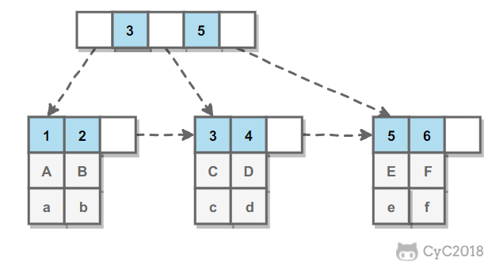
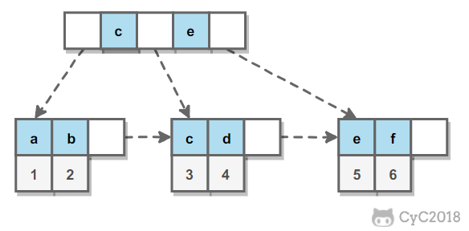

# 一、索引

## B+ Tree 原理

### 1. 数据结构

B Tree 指的是 Balance Tree，也就是平衡树。平衡树是一颗查找树，并且所有叶子节点位于同一层。

B+ Tree 是基于 B Tree 和叶子节点顺序访问指针进行实现，它具有 B Tree 的平衡性，并且通过顺序访问指针来提高区间查询的性能。

在 B+ Tree 中，一个节点中的 key 从左到右非递减排列，如果某个指针的左右相邻 key 分别是 key<sub>i</sub> 和 key<sub>i+1</sub>，且不为 null，则该指针指向节点的所有 key 大于等于 key<sub>i</sub> 且小于等于 key<sub>i+1</sub>。

<div align="center">  </div><br>

### 2. 操作

进行查找操作时，首先在根节点进行二分查找，找到一个 key 所在的指针，然后递归地在指针所指向的节点进行查找。直到查找到叶子节点，然后在叶子节点上进行二分查找，找出 key 所对应的 data。

插入删除操作会破坏平衡树的平衡性，因此在进行插入删除操作之后，需要对树进行分裂、合并、旋转等操作来维护平衡性。

### 3. 与红黑树的比较

红黑树等平衡树也可以用来实现索引，但是文件系统及数据库系统普遍采用 B+ Tree 作为索引结构，这是因为使用 B+ 树访问磁盘数据有更高的性能。

### 4. B+树相对于B树的优势

核心原因：磁盘访问原理。  

（一）B+ 树有更低的树高

平衡树的树高 O(h)=O(log<sub>d</sub>N)，其中 d 为每个节点的出度。红黑树的出度为 2，而 B+ Tree 的出度一般都非常大，所以红黑树的树高 h 很明显比 B+ Tree 大非常多。

（二）磁盘访问原理

操作系统一般将内存和磁盘分割成固定大小的块，每一块称为一页，内存与磁盘以页为单位交换数据。数据库系统将索引的一个节点的大小设置为页的大小，使得一次 I/O 就能完全载入一个节点。

如果数据不在同一个磁盘块上，那么通常需要移动制动手臂进行寻道，而制动手臂因为其物理结构导致了移动效率低下，从而增加磁盘数据读取时间。B+ 树相对于红黑树有更低的树高，进行寻道的次数与树高成正比，在同一个磁盘块上进行访问只需要很短的磁盘旋转时间，所以 B+ 树更适合磁盘数据的读取。

（三）磁盘预读特性

为了减少磁盘 I/O 操作，磁盘往往不是严格按需读取，而是每次都会预读。预读过程中，磁盘进行顺序读取，顺序读取不需要进行磁盘寻道，并且只需要很短的磁盘旋转时间，速度会非常快。并且可以利用预读特性，相邻的节点也能够被预先载入。

B+树的优势在于查找效率上，具体说明：
　　首先，Ｂ＋树的查找和Ｂ树一样，类似于二叉查找树。起始于根节点，自顶向下遍历树，选择其分离值在要查找值的任意一边的子指针。在节点内部典型的使用是二分查找来确定这个位置。
　　（1）不同的是，Ｂ＋树中间节点没有卫星数据（索引元素所指向的数据记录），只有索引，而Ｂ树每个结点中的每个关键字都有卫星数据；这就意味着同样的大小的磁盘页可以容纳更多节点元素，在相同的数据量下，Ｂ＋树更加“矮胖”，ＩＯ操作更少
　　（2）、其次，因为卫星数据的不同，导致查询过程也不同；Ｂ树的查找只需找到匹配元素即可，最好情况下查找到根节点，最坏情况下查找到叶子结点，所说性能很不稳定，而Ｂ＋树每次必须查找到叶子结点，性能稳定
　　（3）在范围查询方面，B+树的优势更加明显
B树的范围查找需要不断依赖中序遍历。首先二分查找到范围下限，在不断通过中序遍历，知道查找到范围的上限即可。整个过程比较耗时。
而B+树的范围查找则简单了许多。首先通过二分查找，找到范围下限，然后同过叶子结点的链表顺序遍历，直至找到上限即可，整个过程简单许多，效率也比较高。

B+树相比B树的优势：
　　1.单一节点存储更多的元素，使得查询的IO次数更少；
　　2.所有查询都要查找到叶子节点，查询性能稳定；
　　3.所有叶子节点形成有序链表，便于范围查询。

## MySQL 索引

索引是在存储引擎层实现的，而不是在服务器层实现的，所以不同存储引擎具有不同的索引类型和实现。

### 1. B+Tree 索引

是大多数 MySQL 存储引擎的默认索引类型。

因为不再需要进行全表扫描，只需要对树进行搜索即可，所以查找速度快很多。

因为 B+ Tree 的有序性，所以除了用于查找，还可以用于排序和分组。

可以指定多个列作为索引列，多个索引列共同组成键。

适用于全键值、键值范围和键前缀查找，其中键前缀查找只适用于最左前缀查找。如果不是按照索引列的顺序进行查找，则无法使用索引。

InnoDB 的 B+Tree 索引分为主索引和辅助索引。主索引的叶子节点 data 域记录着完整的数据记录，这种索引方式被称为聚簇索引。因为无法把数据行存放在两个不同的地方，所以一个表只能有一个聚簇索引。

<div align="center">  </div><br>

辅助索引的叶子节点的 data 域记录着主键的值，因此在使用辅助索引进行查找时，需要先查找到主键值，然后再到主索引中进行查找。

<div align="center">  </div><br>

### 2. 哈希索引

哈希索引能以 O(1) 时间进行查找，但是失去了有序性：

- 无法用于排序与分组；
- 只支持精确查找，无法用于部分查找和范围查找。

InnoDB 存储引擎有一个特殊的功能叫“自适应哈希索引”，当某个索引值被使用的非常频繁时，会在 B+Tree 索引之上再创建一个哈希索引，这样就让 B+Tree 索引具有哈希索引的一些优点，比如快速的哈希查找。

### 3. 全文索引

MyISAM 存储引擎支持全文索引，用于查找文本中的关键词，而不是直接比较是否相等。

查找条件使用 MATCH AGAINST，而不是普通的 WHERE。

全文索引使用倒排索引实现，它记录着关键词到其所在文档的映射。

InnoDB 存储引擎在 MySQL 5.6.4 版本中也开始支持全文索引。

### 4. 空间数据索引

MyISAM 存储引擎支持空间数据索引（R-Tree），可以用于地理数据存储。空间数据索引会从所有维度来索引数据，可以有效地使用任意维度来进行组合查询。

必须使用 GIS 相关的函数来维护数据。

## 索引优化

### 1. 独立的列

在进行查询时，索引列不能是表达式的一部分，也不能是函数的参数，否则无法使用索引。

例如下面的查询不能使用 actor_id 列的索引：

```sql
SELECT actor_id FROM sakila.actor WHERE actor_id + 1 = 5;
```

### 2. 多列索引

在需要使用多个列作为条件进行查询时，使用多列索引比使用多个单列索引性能更好。例如下面的语句中，最好把 actor_id 和 film_id 设置为多列索引。

```sql
SELECT film_id, actor_ id FROM sakila.film_actor
WHERE actor_id = 1 AND film_id = 1;
```

### 3. 索引列的顺序

让选择性最强的索引列放在前面。

索引的选择性是指：不重复的索引值和记录总数的比值。最大值为 1，此时每个记录都有唯一的索引与其对应。选择性越高，每个记录的区分度越高，查询效率也越高。

例如下面显示的结果中 customer_id 的选择性比 staff_id 更高，因此最好把 customer_id 列放在多列索引的前面。

```sql
SELECT COUNT(DISTINCT staff_id)/COUNT(*) AS staff_id_selectivity,
COUNT(DISTINCT customer_id)/COUNT(*) AS customer_id_selectivity,
COUNT(*)
FROM payment;
```

```html
   staff_id_selectivity: 0.0001
customer_id_selectivity: 0.0373
               COUNT(*): 16049
```

### 4. 前缀索引

对于 BLOB、TEXT 和 VARCHAR 类型的列，必须使用前缀索引，只索引开始的部分字符。

前缀长度的选取需要根据索引选择性来确定。

### 5. 覆盖索引

索引包含所有需要查询的字段的值。

具有以下优点：

- 索引通常远小于数据行的大小，只读取索引能大大减少数据访问量。
- 一些存储引擎（例如 MyISAM）在内存中只缓存索引，而数据依赖于操作系统来缓存。因此，只访问索引可以不使用系统调用（通常比较费时）。
- 对于 InnoDB 引擎，若辅助索引能够覆盖查询，则无需访问主索引。

## 索引的优点

- 大大减少了服务器需要扫描的数据行数。

- 帮助服务器避免进行排序和分组，以及避免创建临时表（B+Tree 索引是有序的，可以用于 ORDER BY 和 GROUP BY 操作。临时表主要是在排序和分组过程中创建，不需要排序和分组，也就不需要创建临时表）。

- 将随机 I/O 变为顺序 I/O（B+Tree 索引是有序的，会将相邻的数据都存储在一起）。

## 索引的使用条件

- 对于非常小的表、大部分情况下简单的全表扫描比建立索引更高效；

- 对于中到大型的表，索引就非常有效；

- 但是对于特大型的表，建立和维护索引的代价将会随之增长。这种情况下，需要用到一种技术可以直接区分出需要查询的一组数据，而不是一条记录一条记录地匹配，例如可以使用分区技术。


# 聚簇索引、联合索引、覆盖索引

首先，不同数据库引擎采用的索引可能不同。  
索引：MySQL的索引是B+树。  
B树和B+树的区别是什么？B树内部结点上可以存储真实的KV，而B+树内部节点上只存在Key用于索引，所有的KV都存储在叶子节点上。    
聚簇索引：B+树的Value中存放整个记录。  
非聚簇索引：B+树的Value中只存放指向记录的指针。  
对于InnoDB引擎来说，主键索引是聚簇索引，非主键索引是联合索引。  
在非主键索引的B+树上直接存储记录信息，就可以避免再次查询，这叫覆盖索引。覆盖索引是用空间换时间，避免二次查询。

InnoDB的主键索引是聚簇索引，MyIsam不论是否为主键所有的索引都是非聚簇索引。
**mysql中聚簇索引的设定（InnoDB）**
聚簇索引默认是主键，如果表中没有定义主键，InnoDB 会选择一个唯一的非空索引代替。如果没有这样的索引，InnoDB 会隐式定义一个主键来作为聚簇索引。InnoDB 只聚集在同一个页面中的记录。包含相邻健值的页面可能相距甚远。

# B+树与hash的区别

B+ Tree索引和Hash索引区别

* 哈希索引适合等值查询，但是不无法进行范围查询
* 哈希索引没办法利用索引完成排序
* 哈希索引不支持多列联合索引的最左匹配规则
* 如果有大量重复键值得情况下，哈希索引的效率会很低，因为存在哈希碰撞问题

# 聚簇索引的缺点

聚簇索引的缺点：

1. 插入速度严重依赖于插入顺序，按照主键的顺序插入是最快的方式，否则将会出现页分裂，严重影响性能。因此，对于InnoDB表，我们一般都会定义一个自增的ID列为主键。  
2. 更新主键的代价很高，因为将会导致被更新的行移动。因此，对于InnoDB表，我们一般定义主键为不可更新。
3. 二级索引访问需要两次索引查找，第一次找到主键值，第二次根据主键值找到行数据。二级索引的叶节点存储的是主键值，而不是行指针（非聚簇索引存储的是指针或者说是地址），这是为了减少当出现行移动或数据页分裂时二级索引的维护工作，但会让二级索引占用更多的空间。
4. 采用聚簇索引插入新值比采用非聚簇索引插入新值的速度要慢很多，因为插入要保证主键不能重复，判断主键不能重复，采用的方式在不同的索引下面会有很大的性能差距，聚簇索引遍历所有的叶子节点，非聚簇索引也判断所有的叶子节点，但是聚簇索引的叶子节点除了带有主键还有记录值，记录的大小往往比主键要大的多。这样就会导致聚簇索引在判定新记录携带的主键是否重复时进行昂贵的I/O代价。

# 为什么主键通常建议使用自增id

聚簇索引的数据的物理存放顺序与索引顺序是一致的，即：只要索引是相邻的，那么对应的数据一定也是相邻地存放在磁盘上的。如果主键不是自增id，那么可以想象，它会干些什么，不断地调整数据的物理地址、分页，当然也有其他一些措施来减少这些操作，但却无法彻底避免。但，如果是自增的，那就简单了，它只需要一页一页地写，索引结构相对紧凑，磁盘碎片少，效率也高。

因为MyISAM的主索引并非聚簇索引，那么他的数据的物理地址必然是凌乱的，拿到这些物理地址，按照合适的算法进行I/O读取，于是开始不停地寻道不停地旋转。聚簇索引则只需一次I/O。

如果涉及到大数据量的排序、全表扫描、count之类的操作的话，还是MyISAM占优势些，因为索引所占空间小，这些操作是需要在内存中完成的。 

# 创建索引的注意事项

* 对于取值较少的字段不要建立索引
* 建立多字段索引的时候注意顺序，把区分度高的字段放在前面能够提高效率
