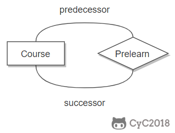
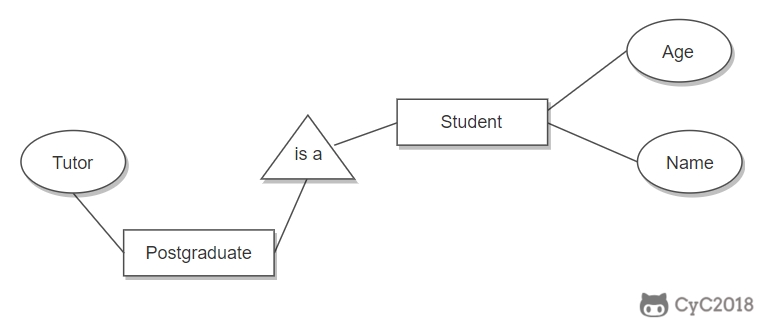

# 七、关系数据库设计理论

## 函数依赖

记 A->B 表示 A 函数决定 B，也可以说 B 函数依赖于 A。

如果 {A1，A2，... ，An} 是关系的一个或多个属性的集合，该集合函数决定了关系的其它所有属性并且是最小的，那么该集合就称为键码。

对于 A->B，如果能找到 A 的真子集 A'，使得 A'-> B，那么 A->B 就是部分函数依赖，否则就是完全函数依赖。

对于 A->B，B->C，则 A->C 是一个传递函数依赖。

## 异常

以下的学生课程关系的函数依赖为 {Sno, Cname} -> {Sname, Sdept, Mname, Grade}，键码为 {Sno, Cname}。也就是说，确定学生和课程之后，就能确定其它信息。

| Sno | Sname  | Sdept  | Mname  | Cname  | Grade |
| :-: | :----: | :----: | :----: | :----: | :---: |
|  1  | 学生-1 | 学院-1 | 院长-1 | 课程-1 |  90   |
|  2  | 学生-2 | 学院-2 | 院长-2 | 课程-2 |  80   |
|  2  | 学生-2 | 学院-2 | 院长-2 | 课程-1 |  100  |
|  3  | 学生-3 | 学院-2 | 院长-2 | 课程-2 |  95   |

不符合范式的关系，会产生很多异常，主要有以下四种异常：

- 冗余数据：例如 `学生-2` 出现了两次。
- 修改异常：修改了一个记录中的信息，但是另一个记录中相同的信息却没有被修改。
- 删除异常：删除一个信息，那么也会丢失其它信息。例如删除了 `课程-1` 需要删除第一行和第三行，那么 `学生-1` 的信息就会丢失。
- 插入异常：例如想要插入一个学生的信息，如果这个学生还没选课，那么就无法插入。

## 范式

范式理论是为了解决以上提到四种异常。

高级别范式的依赖于低级别的范式，1NF 是最低级别的范式。

### 1. 第一范式 (1NF)

属性不可分。

### 2. 第二范式 (2NF)

每个非主属性完全函数依赖于键码。

可以通过分解来满足。

 **分解前**  

| Sno | Sname  | Sdept  | Mname  | Cname  | Grade |
| :-: | :----: | :----: | :----: | :----: | :---: |
|  1  | 学生-1 | 学院-1 | 院长-1 | 课程-1 |  90   |
|  2  | 学生-2 | 学院-2 | 院长-2 | 课程-2 |  80   |
|  2  | 学生-2 | 学院-2 | 院长-2 | 课程-1 |  100  |
|  3  | 学生-3 | 学院-2 | 院长-2 | 课程-2 |  95   |

以上学生课程关系中，{Sno, Cname} 为键码，有如下函数依赖：

- Sno -> Sname, Sdept
- Sdept -> Mname
- Sno, Cname-> Grade

Grade 完全函数依赖于键码，它没有任何冗余数据，每个学生的每门课都有特定的成绩。

Sname, Sdept 和 Mname 都部分依赖于键码，当一个学生选修了多门课时，这些数据就会出现多次，造成大量冗余数据。

 **分解后**  

关系-1

| Sno | Sname  | Sdept  | Mname  |
| :-: | :----: | :----: | :----: |
|  1  | 学生-1 | 学院-1 | 院长-1 |
|  2  | 学生-2 | 学院-2 | 院长-2 |
|  3  | 学生-3 | 学院-2 | 院长-2 |

有以下函数依赖：

- Sno -> Sname, Sdept
- Sdept -> Mname

关系-2

| Sno | Cname  | Grade |
| :-: | :----: | :---: |
|  1  | 课程-1 |  90   |
|  2  | 课程-2 |  80   |
|  2  | 课程-1 |  100  |
|  3  | 课程-2 |  95   |

有以下函数依赖：

- Sno, Cname -> Grade

### 3. 第三范式 (3NF)

非主属性不传递函数依赖于键码。

上面的 关系-1 中存在以下传递函数依赖：

- Sno -> Sdept -> Mname

可以进行以下分解：

关系-11

| Sno | Sname  | Sdept  |
| :-: | :----: | :----: |
|  1  | 学生-1 | 学院-1 |
|  2  | 学生-2 | 学院-2 |
|  3  | 学生-3 | 学院-2 |

关系-12

| Sdept  | Mname  |
| :----: | :----: |
| 学院-1 | 院长-1 |
| 学院-2 | 院长-2 |

# 八、ER 图

Entity-Relationship，有三个组成部分：实体、属性、联系。

用来进行关系型数据库系统的概念设计。

## 实体的三种联系

包含一对一，一对多，多对多三种。

- 如果 A 到 B 是一对多关系，那么画个带箭头的线段指向 B；
- 如果是一对一，画两个带箭头的线段；
- 如果是多对多，画两个不带箭头的线段。

下图的 Course 和 Student 是一对多的关系。

  
 

## 表示出现多次的关系

一个实体在联系出现几次，就要用几条线连接。

下图表示一个课程的先修关系，先修关系出现两个 Course 实体，第一个是先修课程，后一个是后修课程，因此需要用两条线来表示这种关系。

  
 

## 联系的多向性

虽然老师可以开设多门课，并且可以教授多名学生，但是对于特定的学生和课程，只有一个老师教授，这就构成了一个三元联系。

  
 

## 表示子类

用一个三角形和两条线来连接类和子类，与子类有关的属性和联系都连到子类上，而与父类和子类都有关的连到父类上。

  
 

# 配置规范

- MySQL 数据库默认使用 InnoDB 存储引擎。
- 保证字符集设置统一，MySQL 数据库相关系统、数据库、表的字符集都使用 UTF8，应用程序连接、展示等可以设置字符集的地方也都统一设置为 UTF8 字符集。
  注：UTF8 格式是存储不了表情类数据，需要使用 UTF8MB4，可在 MySQL 字符集里面设置。在 8.0 中已经默认为 UTF8MB4，可以根据公司的业务情况进行统一或者定制化设置。
- MySQL 数据库的事务隔离级别默认为 RR（Repeatable-Read），建议初始化时统一设置为 RC（Read-Committed），对于 OLTP 业务更适合。
- 数据库中的表要合理规划，控制单表数据量，对于 MySQL 数据库来说，建议单表记录数控制在 2000W 以内。
- MySQL 实例下，数据库、表数量尽可能少；数据库一般不超过 50 个，每个数据库下，数据表数量一般不超过 500 个（包括分区表）。

# 建表规范：

- InnoDB 禁止使用外键约束，可以通过程序层面保证。
- 存储精确浮点数必须使用 DECIMAL 替代 FLOAT 和 DOUBLE。
- 整型定义中无需定义显示宽度，比如：使用 INT，而不是 INT(4)。
- 不建议使用 ENUM 类型，可使用 TINYINT 来代替。
- 尽可能不使用 TEXT、BLOB 类型，如果必须使用，建议将过大字段或是不常用的描述型较大字段拆分到其他表中；另外，禁止用数据库存储图片或文件。
- 存储年时使用 YEAR(4)，不使用 YEAR(2)。
- 建议字段定义为 NOT NULL。
- 建议 DBA 提供 SQL 审核工具，建表规范性需要通过审核工具审核后。

# 命名规范

- 库、表、字段全部采用小写。
- 库名、表名、字段名、索引名称均使用小写字母，并以“\_”分割。
- 库名、表名、字段名建议不超过 12 个字符。（库名、表名、字段名支持最多 64 个字符，但为了统一规范、易于辨识以及减少传输量，统一不超过 12 字符）
- 库名、表名、字段名见名知意，不需要添加注释。

# 索引规范

- 索引建议命名规则：`idx_col1_col2[_colN]`、`uniq_col1_col2[_colN]`（如果字段过长建议采用缩写）。
- 索引中的字段数建议不超过 5 个。
- 单张表的索引个数控制在 5 个以内。
- InnoDB 表一般都建议有主键列，尤其在高可用集群方案中是作为必须项的。
- 建立复合索引时，优先将选择性高的字段放在前面。
- UPDATE、DELETE 语句需要根据 WHERE 条件添加索引。
- 不建议使用 % 前缀模糊查询，例如 LIKE “%weibo”，无法用到索引，会导致全表扫描。
- 合理利用覆盖索引，例如：SELECT email，uid FROM user_email WHERE uid=xx，如果 uid 不是主键，可以创建覆盖索引 idx_uid_email（uid，email）来提高查询效率。
- 避免在索引字段上使用函数，否则会导致查询时索引失效。
- 确认索引是否需要变更时要联系 DBA。

# 应用规范：

- 避免使用存储过程、触发器、自定义函数等，容易将业务逻辑和 DB 耦合在一起，后期做分布式方案时会成为瓶颈。
- 考虑使用 UNION ALL，减少使用 UNION，因为 UNION ALL 不去重，而少了排序操作，速度相对比 UNION 要快，如果没有去重的需求，优先使用 UNION ALL。
- 考虑使用 limit N，少用 limit M，N，特别是大表或 M 比较大的时候。
- 减少或避免排序，如：group by 语句中如果不需要排序，可以增加 order by null。
- 统计表中记录数时使用 COUNT(\*)，而不是 COUNT(primary_key) 和 COUNT(1)。
- InnoDB 表避免使用 COUNT(\*) 操作，计数统计实时要求较强可以使用 Memcache 或者 Redis，非实时统计可以使用单独统计表，定时更新。
- 做字段变更操作（modify column/change column）的时候必须加上原有的注释属性，否则修改后，注释会丢失。
- 使用 prepared statement 可以提高性能并且避免 SQL 注入。
- SQL 语句中 IN 包含的值不应过多。
- UPDATE、DELETE 语句一定要有明确的 WHERE 条件。
- WHERE 条件中的字段值需要符合该字段的数据类型，避免 MySQL 进行隐式类型转化。
- SELECT、INSERT 语句必须显式的指明字段名称，禁止使用 SELECT \* 或是 INSERT INTO table_name values()。
- INSERT 语句使用 batch 提交（INSERT INTO table_name VALUES(),(),()……），values 的个数不应过多。
