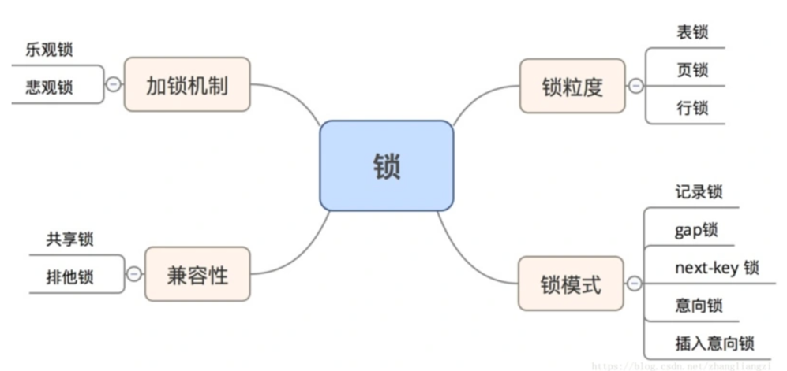

> 锁是计算机协调多个进程或纯线程并发访问某一资源的机制。在数据库中，除传统的计算资源(CPU,RAM,I/O)  
的争用外,数据也是一种供许多用户共享的资源。如果保证数据并发访问的一致性、有效性是所有数据库必须解决  
的一个问题，锁冲突也是影响数据库并发访问性能的一个因素，  
从这个角度来看，锁对数据库而言显得尤为重要，也更加复杂。
锁机制用于管理对共享资源的并发访问

# 锁的分类



## 按照锁的粒度分类
MySQL有四种类型的锁。
* 元数据锁：MySQL 5.5新特性，锁住表结构。
* 表锁：锁住整个表。mysql中锁定粒度最大的一种锁，对整张表进行加锁，实现简单，资源消耗较少，加锁快，不会出现死锁。由于锁定粒度最大，触发锁冲突的概率最高，并发度最低，myisam和innodb引擎都支持表级锁。触发表锁的情景：
  * 插入数据
  * 创建表
* 行锁：锁住一行，也就是锁住一条记录。开销大，加锁慢，会出现死锁，锁定粒度最小，发生锁冲突的概率最低，并发程度也最高。
* 页锁：仅在比较少见的BDB存储引擎存在。开销和加锁时间介于表锁和行锁之间，会出现死锁，并发程度一般。


当你怀疑是并发线程影响了查询的时候，使用SHOW PROCESSLIST命令查看状态
## 按照加锁机制分类
加锁是针对写操作而言的，多个写操作拼在一起就叫做事务。  
事务具有原子性，要么一个事务的写操作全部执行，要么一个写操作也不执行。  
悲观锁和乐观锁都能够实现事务的原子性，区别在于它们在不同场景下的性能不一样。  
悲观锁加锁的粒度大，发生冲突的概率低，同时造成并发性降低；乐观锁加锁的粒度小，发生冲突的概率略高，但是并发性也略高。

* 悲观锁：悲观锁悲观地假定大概率会发生更新冲突，访问或者处理数据前加排他锁，在整个数据处理过程中锁定数据，事务提交或者回滚后才释放锁
* 乐观锁：乐观锁乐观地假定大概率不会发生更新冲突，访问、处理数据的时候不加锁，只在更新数据的时候查看版本号是否有冲突，有则处理、无则提交事务

## 按照锁的兼容性分类
* 共享锁：读锁，读操作之间互相不冲突，但是读操作跟写操作互相冲突，也就是会阻塞写请求
* 排他锁：写锁，写操作之间互相冲突，写操作跟读操作互相冲突

## 按照锁的模式进行分类
* 记录锁：对符合条件的项进行加锁。
* gap锁（间隙锁）：对区间进行加锁。不包含符合条件的索引项本身，只是锁定记录的范围，其他事务不能在锁范围内插入数据，这样就防止了别的数据新增幻影行(幻读)
* next-key锁（临键锁）：锁定索引项本身和索引范围，即record lock + gap lock的结合 可解决幻读问题
* 意向锁（（insert intention locks）：为了允许表锁和行锁共存，实现多粒度锁机制，innodb还有两种内部使用的意向锁(表级锁)分为：
  * 意向共享锁(IS) 事务打算给数据行加共享锁，必须先取得该表的IS锁
* 意向排他锁(IX) 事务打算给数据行加排他锁，必须先取得该表的IX锁
意向锁是在给某一行进行加锁的时候，mysql会自动为这一行所处的表进行加意向锁，无需用户任何处理。
锁的表示：S，读锁；X，写锁；IS：意向读锁；IX：意向写锁。

| -   |IS  |IX   | S | X |
|-----|--- |---  |---|---|
| IS  |兼容 |兼容 |兼容|冲突|
| IX  |兼容 |兼容 |冲突|冲突|
| S   |兼容 |冲突 |兼容|冲突|
| X   |冲突 |冲突 |冲突|冲突|
* 插入意向锁：插入意向锁是gap锁的一种，这种锁会在记录插入前设置。这种锁表示了多个事务在插入到相同的索引间隙的时候，只要他们不是插入到相同的位置上就不必彼此互相等待。在获取插入的排它锁之前，需要先获取插入意向锁


# 什么情况下触发表锁？
在执行某些 ddl 时，比如alter table等操作，会对整个表加锁，也可以手动执行锁表语句：`LOCK TALBES table_name [READ | WRITE]`，READ 为共享锁，WRITE 为排他锁，手动解锁的语句为：UNLOCK TABLES，会直接释放当前会话持有的所有表锁。

```plain
SET autocommit=0;
LOCK TABLES t1 WRITE, t2 READ, ...;
... do something with tables t1 and t2 here ...
COMMIT;
UNLOCK TABLES;
```

其实不管是读操作(select)还是写操作(update,delete,insert),只要涉及到带有筛选条件的语句，如果筛选条件中没有用到索引，就会触发全表扫描，区别是读操作可能加读锁(也有可能不加锁,mvcc中的快照读是通过版本号实现的，不加读锁，当前读需要加读锁)，写操作默认需要对影响的数据集隐式加写锁,那么如果发现影响的数据集没有用到索引或者是索引效果不好(区分度不够高,导致需要扫描表中大部分数据)再或者全表扫描的时候，就会锁住整张表，导致默认的行级锁升级为表级锁，因此我们总结下以下情况会导致锁表
* 全表更新 事务需要更新大部分数据或全部数据，如果使用行级锁，会导致事务执行效率低，从而导致其他事务长时间等待锁和更多的锁冲突
* 多表级联 事务涉及多张表，比较复杂的关联查询，很可能造成死锁，这种情况若能一次性锁住事务涉及的表，从而避免死锁，减少数据库事务回滚所带来的开销
* 本应部分更新，但是因为筛选条件中未用到索引或者索引区分度程度不高(innodb认为全表扫描比走索引效率更高导致索引失效的情况)，导致全表扫描，这个时候就要通过explain去查看下查询计划，看下查询语句是否真的用到了索引

# 锁优化部分
* 尽量让数据检索都通过索引来完成，避免无索引或者索引失效导致行级锁升级为表级锁  
* 合理设计索引，以缩小加锁范围，避免间隙锁造成不该锁定的键值被锁定
* 尽量控制事务的大小，因为行级锁的复杂性会加大资源使用量以及锁定时间

这里面实际上第三种情况是可以避免的，在做业务时，需要谨慎的加索引,在合适的列上创建索引，索引列区分程度是否高(主键索引和唯一索引不用说区分度百分百，如果能用到主键索引或者唯一索引就尽可能的使用这两种索引，如果不能使用，确保索引列区分程度够高)


# 死锁
MySQL死锁的情况有哪些？请举例说明。

| 语句顺序\事务  | 	事务一	                                           | 事务二                                             |
|----------|-------------------------------------------------|-------------------------------------------------|
| T1	      | begin;                                          | 	begin;                                         |
| T2	      | select * from student where id = 1  for update; | 	select * from student where id = 2 for update; |
| T3       | 	                                               | select * from student where id = 2  for update; |
| T4（死锁发生） || select * from student where id = 1 for update;  |

这是最简单最典型的死锁的情况了，两个事务互相锁定持有资源，并且等待对方的资源，最后形成一个环，死锁出现。最后某个事务回滚，写业务代码的时候，应该对并发条件可能出现这种情况的语句有所警觉。  

当死锁发生的时候，有一个事务会失败，然后触发重试机制，如果一直重试相当于卡死（发生概率较低）。  
使用 SHOW ENGINE INNODB STATUS 语句可以看到最近一次的死锁信息，在调试的时候很有帮助。

出现死锁后某个事务会回滚，其他事务成功，上层业务会捕获到死锁错误，再重试一般会成功，如果出现大量锁重试，则说明哪里出了问题。  

