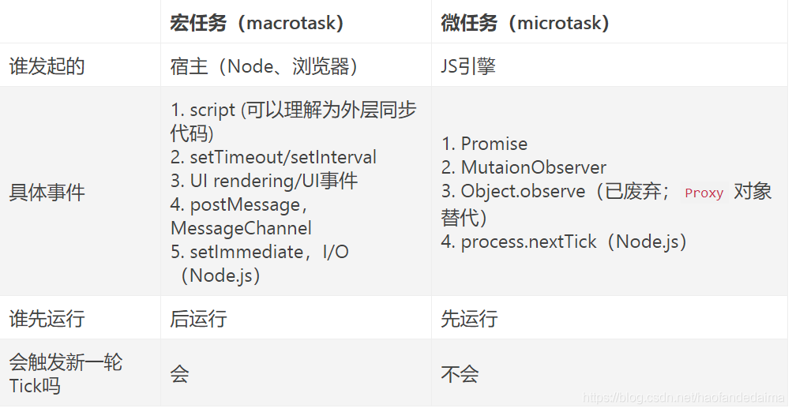

Event Loop
JS引擎常驻于内存中，等待宿主将JS代码或函数传递给它。 也就是等待宿主环境分配宏观任务，反复等待 - 执行即为事件循环。 Event Loop中，每一次循环称为tick，每一次tick的任务如下：

执行栈选择最先进入队列的宏任务（一般都是script），执行其同步代码直至结束；
检查是否存在微任务，有则会执行至微任务队列为空；
如果宿主为浏览器，可能会渲染页面；
开始下一轮tick，执行宏任务中的异步代码（setTimeout等回调）。


# 宏任务和微任务
ES6 规范中，microtask 称为 jobs，macrotask 称为 task 宏任务是由宿主发起的，而微任务由JavaScript自身发起。

# 请描述下列代码的输出
```js
async function async1() {
	console.log('async1 start')
	await async2()
	console.log('async1 end')
}
async function async2() {
	console.log('async2')
}
console.log('script start')
setTimeout(function() {
	console.log('settimeout')
}
async1()
new Promise(function(resolve) {
	console.log('promise1')
	resolve()
}).then(function() {
	console.log('promise2')
})
console.log('script end')
```
答案是：
```plain
script start
async1 start
async2
promise1
script end
async1 end
promise2
settimeout
```

script start 和 async1 start 是主线，所以会执行，这没有问题。await async2()的时候，会等待async2()函数返回的Promise，因此，async2()也会在主线里面执行，async2()没有返回东西，但是依旧会await它，也就是往微任务队列里面放一个空Promise。

> promise本身是同步的立即执行函数，当在executor中执行resolve或者reject的时候，此时是异步操作，会执行then、catch,这个才是异步的task，会放到微任务的栈中

接下来new了一个Promise，这个Promise的构造函数接收一个function，这个function会立即执行。最后script end。  
在第二轮循环中，先执行微任务，再执行宏任务。微任务队列里面有async1、promise2；宏任务队列里面有settimeout。因此打印顺序是async1、promise2、settimeout。  