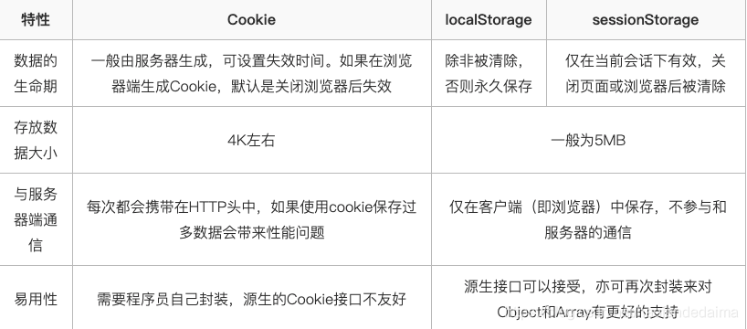

强缓存和协商缓存（浏览器缓存机制）
# 强缓存
Expires 是以前用来控制缓存的http头，Cache-Control是新版的API。 现在首选 Cache-Control。 如果在Cache-Control响应头设置了 "max-age" 或者 "s-max-age" 指令，那么 Expires 头会被忽略。 响应头设置方式： Expires: Wed, 21 Oct 2015 07:28:00 GMT Expires 响应头包含日期/时间， 即在此时候之后，响应过期。 注意： 因为过期标准的时间用的是本地时间，所以不靠谱，所以要使用Cache-Control代替Expires

cache-control: max-age=xxxx，public
客户端和代理服务器都可以缓存该资源； 客户端在xxx秒的有效期内，如果有请求该资源的需求的话就直接读取缓存,statu code:200 ，如果用户做了刷新操作，就向服务器发起http请求

cache-control: max-age=xxxx，private
只让客户端可以缓存该资源；代理服务器不缓存 客户端在xxx秒内直接读取缓存,statu code:200

cache-control: max-age=xxxx，immutable
客户端在xxx秒的有效期内，如果有请求该资源的需求的话就直接读取缓存,statu code:200 ，即使用户做了刷新操作，也不向服务器发起http请求

cache-control: no-cache
跳过设置强缓存，但是不妨碍设置协商缓存；一般如果你做了强缓存，只有在强缓存失效了才走协商缓存的，设置了no-cache就不会走强缓存了，每次请求都回询问服务端。

cache-control: no-store
不缓存，这个会让客户端、服务器都不缓存，也就没有所谓的强缓存、协商缓存了

# 协商缓存
etag：每个文件有一个，改动文件了就变了，就是个文件hash，每个文件唯一。

last-modified：文件的修改时间，精确到秒

ETag和Last-Modified的作用和用法，他们的区别：

1.Etag要优于Last-Modified。Last-Modified的时间单位是秒，如果某个文件在1秒内改变了多次，那么他们的Last-Modified其实并没有体现出来修改，但是Etag每次都会改变确保了精度；

2.在性能上，Etag要逊于Last-Modified，毕竟Last-Modified只需要记录时间，而Etag需要服务器通过算法来计算出一个hash值；

3.在优先级上，服务器校验优先考虑Etag。

浏览器缓存过程
1.浏览器第一次加载资源，服务器返回200，浏览器将资源文件从服务器上请求下载下来，并把response header及该请求的返回时间一并缓存；

2.下一次加载资源时，先比较当前时间和上一次返回200时的时间差，如果没有超过cache-control设置的max-age，则没有过期，命中强缓存，不发请求直接从本地缓存读取该文件（如果浏览器不支持HTTP1.1，则用expires判断是否过期）；如果时间过期，则向服务器发送header带有If-None-Match和If-Modified-Since的请求

3.服务器收到请求后，优先根据Etag的值判断被请求的文件有没有做修改，Etag值一致则没有修改，命中协商缓存，返回304；如果不一致则有改动，直接返回新的资源文件带上新的Etag值并返回200；；

4.如果服务器收到的请求没有Etag值，则将If-Modified-Since和被请求文件的最后修改时间做比对，一致则命中协商缓存，返回304；不一致则返回新的last-modified和文件并返回200；

# cookie、sessionStorage、localStorage的区别
