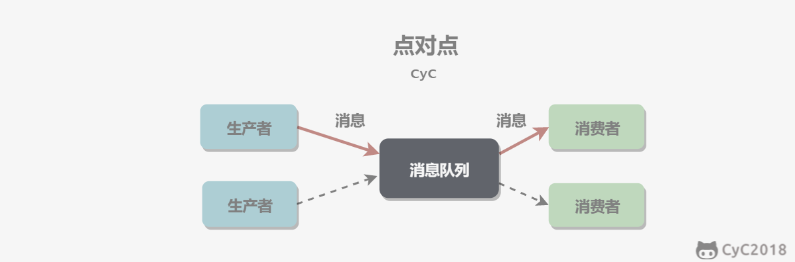
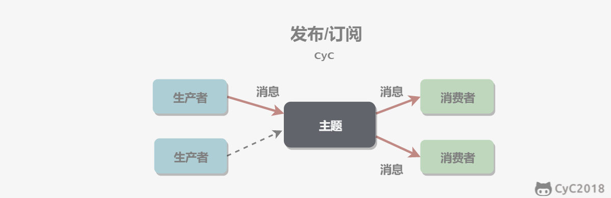
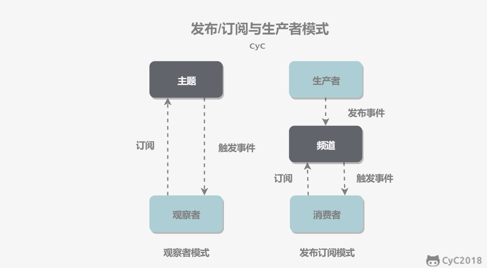

# 一、消息模型

## 点对点

消息生产者向消息队列中发送了一个消息之后，只能被一个消费者消费一次。

  
 

## 发布/订阅

消息生产者向频道发送一个消息之后，多个消费者可以从该频道订阅到这条消息并消费。

  
 

发布与订阅模式和观察者模式有以下不同：

- 观察者模式中，观察者和主题都知道对方的存在；而在发布与订阅模式中，生产者与消费者不知道对方的存在，它们之间通过频道进行通信。
- 观察者模式是同步的，当事件触发时，主题会调用观察者的方法，然后等待方法返回；而发布与订阅模式是异步的，生产者向频道发送一个消息之后，就不需要关心消费者何时去订阅这个消息，可以立即返回。

  
 

# 二、使用场景
消息队列的三个主要作用：
* 异步
* 解耦
* 削峰

## 异步处理

发送者将消息发送给消息队列之后，不需要同步等待消息接收者处理完毕，而是立即返回进行其它操作。消息接收者从消息队列中订阅消息之后异步处理。

例如在注册流程中通常需要发送验证邮件来确保注册用户身份的合法性，可以使用消息队列使发送验证邮件的操作异步处理，用户在填写完注册信息之后就可以完成注册，而将发送验证邮件这一消息发送到消息队列中。

只有在业务流程允许异步处理的情况下才能这么做，例如上面的注册流程中，如果要求用户对验证邮件进行点击之后才能完成注册的话，就不能再使用消息队列。

## 流量削锋

在高并发的场景下，如果短时间有大量的请求到达会压垮服务器。

可以将请求发送到消息队列中，服务器按照其处理能力从消息队列中订阅消息进行处理。

## 应用解耦

如果模块之间不直接进行调用，模块之间耦合度就会很低，那么修改一个模块或者新增一个模块对其它模块的影响会很小，从而实现可扩展性。

通过使用消息队列，一个模块只需要向消息队列中发送消息，其它模块可以选择性地从消息队列中订阅消息从而完成调用。

# 三、可靠性

## 发送端的可靠性

发送端完成操作后一定能将消息成功发送到消息队列中。

实现方法：在本地数据库建一张消息表，将消息数据与业务数据保存在同一数据库实例里，这样就可以利用本地数据库的事务机制。事务提交成功后，将消息表中的消息转移到消息队列中，若转移消息成功则删除消息表中的数据，否则继续重传。

## 接收端的可靠性

接收端能够从消息队列成功消费一次消息。

两种实现方法：

- 保证接收端处理消息的业务逻辑具有幂等性：只要具有幂等性，那么消费多少次消息，最后处理的结果都是一样的。
- 保证消息具有唯一编号，并使用一张日志表来记录已经消费的消息编号。

# 常见的消息队列
* kafka：java语言，使用最为广泛
* RocketMQ：阿里巴巴出品
* RabbitMQ：erlang语言开发
* ActiveMQ：即将被淘汰

# 用消息队列处理日志
* Kafka ：接收用户日志的消息队列。
* Logstash ：对接 Kafka 写入的日志，做日志解析，统一成 JSON 输出给 Elasticsearch 中。
* Elasticsearch ：实时日志分析服务的核心技术，一个 schemaless ，实时的数据存储服务，通过 index 组织数据，兼具强大的搜索和统计功能。
* Kibana ：基于 Elasticsearch 的数据可视化组件，超强的数据可视化能力是众多公司选择 ELK stack 的重要原因。

# 消息队列的缺点
* 系统可用性降低。
系统引入的外部依赖越多，越容易挂掉。本来你就是 A 系统调用 BCD 三个系统的接口就好了，本来 ABCD 四个系统好好的，没啥问题，你偏加个 MQ 进来，万一 MQ 挂了咋整，MQ 一挂，整套系统崩溃的，你不就完了？所以，消息队列一定要做好高可用。
* 系统复杂度提高。
主要需要多考虑，1）消息怎么不重复消息。2）消息怎么保证不丢失。3）需要消息顺序的业务场景，怎么处理。
* 一致性问题。
A 系统处理完了直接返回成功了，人都以为你这个请求就成功了。但是问题是，要是 B、C。D 三个系统那里，B、D 两个系统写库成功了，结果 C 系统写库失败了，咋整？你这数据就不一致了。
当然，这不仅仅是 MQ 的问题，引入 RPC 之后本身就存在这样的问题。如果我们在使用 MQ 时，一定要达到数据的最终一致性。即，C 系统最终执行完成。

# 消息队列如何保证消息不被重复消费
首先评估是否允许重复消费，如果可以重复消费，那就不用做额外处理了。  
首先确定消息队列中每条消息的最多存活时间，以此来决定redis的过期时间，当消费一条消息之后，向redis中插入这条消息的id。只需要保证最近若干天内没有重复消费即可，因为消息存活时间有限。

# 消息队列如何保证数据可靠性传输（如何防止数据丢失）
消息队列有三个组成部分：生产者、消费者、消息队列。数据丢失的三个来源：
* 如果生产者丢失数据：发送消息失败，重发消息即可。
* 如果消息队列丢失数据：开启消息队列持久化，防止消息队列崩溃之后的数据丢失。
* 如果消费者丢失数据：如果消费者成功消费，需要告知消息队列，否则表示没能成功消费。

# 消息队列如何保证消息的顺序性
把需要保持顺序的消息放到同一个分区中，不同分区之间一定是并行的。  